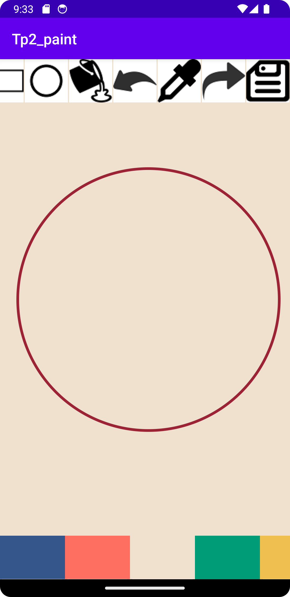
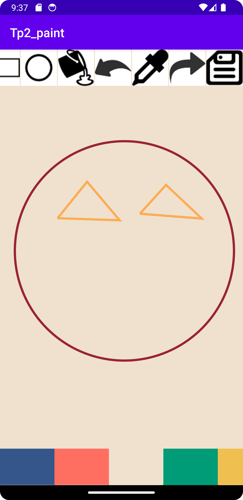
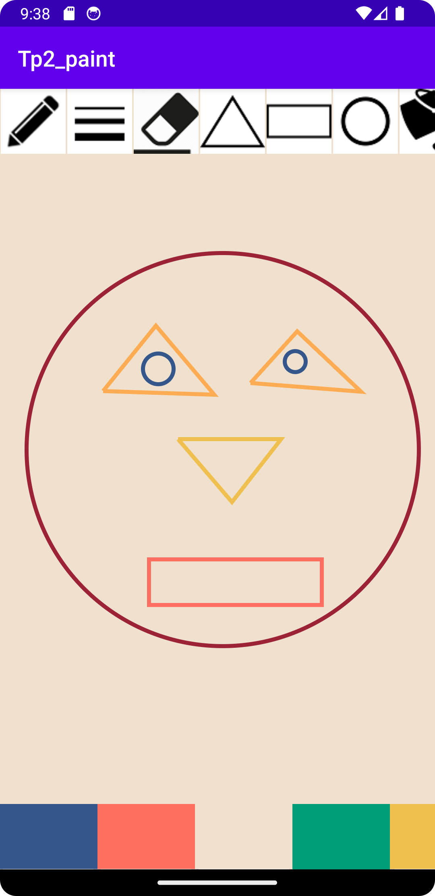
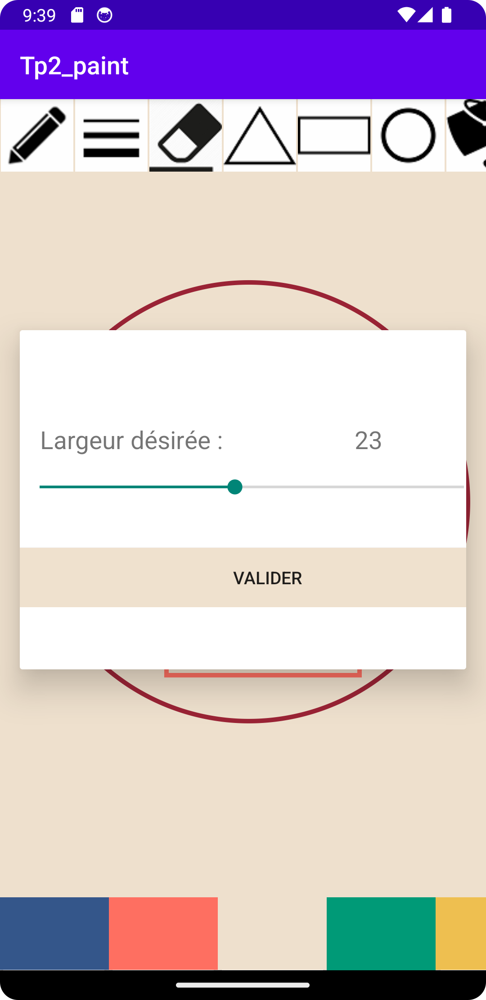
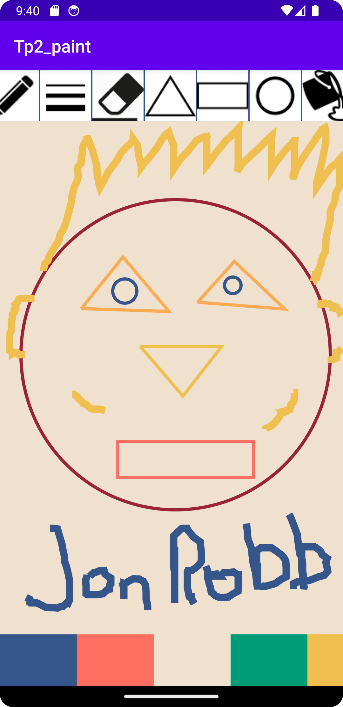



 

<h1 align="center">Simple Paint</h1>

  

    A simple paint application that allows users doing basic drawing and editing operations.
  

<!-- TABLE OF CONTENTS -->

  
Table of Contents

  <ol>
    <li>
      <a href="#about-the-project">About The Project</a>
      <ul>
        <li><a href="#built-with">Built With</a></li>
      </ul>
    </li>
    <li><a href="#usage">Usage</a></li>
    <li><a href="#contact">Contact</a></li>
  </ol>

<!-- ABOUT THE PROJECT -->
## About The Project
  

    This school project is where I started my Android app development journey. It's a simple painting app that I created using Android Studio. While it might not have all the fancy features, I'm pretty proud of it because it's the first complete Android project I ever built. It helped me get a grip on Java programming, figure out how to design user interfaces with XML, and understand how Android development works. Even though it's not super fancy, this little app holds a special place in my heart as it marks the beginning of my Android development adventure
  

  

    I haven't made any modifications to the code since the due date, but I've chosen to make it public because I think it's a good example of my early work. I've included some screenshots to give you an idea of what the app looks like. The app is not available on the Google Play Store.
  

### Built With

[![Android Studio][androidstudio-img]][androidstudio-url]
[![Java][java-img]][java-url]

<!-- USAGE EXAMPLES -->
## Usage

  As said previously, the app is not available on the Googe Play Store. However, if you want to try it out, you can clone the repository and run it on Android Studio. In any case, here are some screenshots of the app in action.

 
<h3 align="center"> You can do circles </h3>

  

 
<h3 align="center"> You can also do triangles </h3>

  

 
<h3 align="center"> Rectangles are also possible </h3>

  

 
<h3 align="center"> You can choose the width of the pen </h3>

  

 
<h3 align="center"> And then you can do some freedom drawing </h3>

  

 
<h3 align="center"> There are also some other features like choosing the color of the pen, painting the background and selecting a color by clicking on it </h3>
 

(<a href="#readme-top">back to top</a>)

<!-- CONTACT -->
## Contact

[![LinkedIn][linkedin-shield]][linkedin-url] 
[![Gmail][gmail-shield]][gmail-url]
[![Portfolio][portfolio-shield]][portfolio-url]

(<a href="#readme-top">back to top</a>)

<!-- MARKDOWN LINKS & IMAGES -->
<!-- https://www.markdownguide.org/basic-syntax/#reference-style-links -->
<!-- Contact -->
[linkedin-shield]: https://img.shields.io/badge/-LinkedIn-black.svg?style=for-the-badge&logo=linkedin&colorB=555
[linkedin-url]: https://linkedin.com/in/jonathan-robinson-187716274
[gmail-shield]:	https://img.shields.io/badge/Gmail-D14836?style=for-the-badge&logo=gmail&logoColor=white
[gmail-url]: mailto:robinsonjonathan240817@gmail.com
[portfolio-shield]:https://img.shields.io/badge/website-000000?style=for-the-badge&logo=About.me&logoColor=white
[portfolio-url]: https://jonrobinson.ca

<!-- images -->
[img_ingame]: images\magix_boardpic.jpeg
[img_login]: images\magix_login.jpeg
[img_lobby]: images\magix_lobby.jpeg
[img_logo]: images\magix_logo.jpeg

<!-- built with  -->
[androidstudio-img]: https://img.shields.io/badge/Android%20Studio-3DDC84?style=for-the-badge&logo=android-studio&logoColor=white
[androidstudio-url]: https://developer.android.com/studio
[java-img]: https://img.shields.io/badge/Java-ED8B00?style=for-the-badge&logo=java&logoColor=white
[java-url]: https://www.java.com/en/
[github-img]: https://img.shields.io/badge/GitHub-100000?style=for-the-badge&logo=github&logoColor=white
